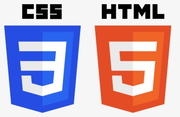
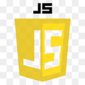

# Proyecto juego de lucha
Este es el proyecto semanal para el curso Full Stack Developer de  [GeeksHubsAcademy](https://geekshubsacademy.com/).

Para  su realización he empleado los conocimientos adquiridos hasta la fecha en :

 

El juego consta de una pantalla de cabecera, una pantalla de seleccion de personajes y equipos, otras tres pantallas de combate y una última pantalla que muestra el equipo vencedor.

El código es muy mejorable pero con los conocimientos adquiridos hasta la fecha buscaba la funcionalidad antes que la belleza....

Este es el enlace al proyecto:
[Mi juego de lucha](https://joanbatiste.github.io/juegoLucha/)

El aprendizaje que me llevo de este proyecto son la importancia del saber trabajar en equipo y el saber tomar decisiones para cumplir el objetivo del mismo.

Especial agradecimiento a mis compañeros sin los cuáles no habría podido llevarlo a cabo:
- [Carlos](https://github.com/Carlos-Val)
- [Adrian](https://github.com/devian5)
- [Diego](https://github.com/diegogb-08)
- [Álvaro](https://github.com/Alvaro-78)

